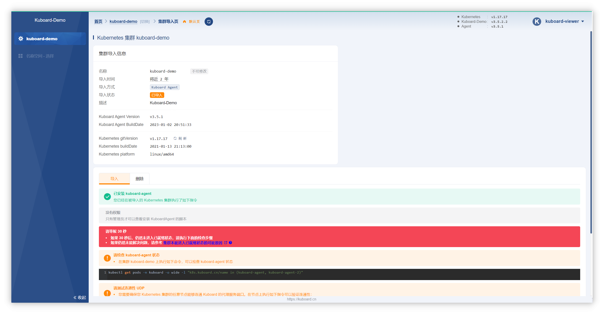

## 裸机搭建（Bare Metal）

### 安装前导

#### 安装CentOS

- 版本：CentOS7
- Arch：x86_64
- 内容版本：Minimal
- 版本号：2009

#### 主节点需要组件

- docker
- kubectl 集群命令行交互工具
- kubeadm 集群初始化工具

#### 工作节点需要组件

- docker
- kubelet 管理Pod和容器
- kube-proxy 网络代理

#### 开始安装

**以下命令在所有服务器上执行**

>可以试下 [这个项目](https://github.com/lework/kainstall)，用脚本快速搭建 K8S 裸机集群

>如果完全熟知了kubernetes的搭建流程可以使用[sealos](https://www.sealos.io/zh-Hans/docs/getting-started/kuberentes-life-cycle)进行搭建和维护

**1、每个节点分别设置对应的主机名**

```shell
hostnamectl set-hostname master 
hostnamectl set-hostname node1 
hostnamectl set-hostname node2
```

**2、所有节点都修改hosts**

```shell
vim /etc/hosts
192.168.159.142 master
192.168.159.143 node1 
192.168.159.144 node2 
```

**3、所有节点关闭 SELinux**

>安全增强式Linux(Security-Enhanced Linux)是一个Linux内核的安全模块，其提供了访问控制安全策略机制，包括了强制访问控制。 SELinux是一组内核修改和用户空间工具，已经被添加到各种Linux发行版中。其软件架构力图将安全决策的执行与安全策略分离，并简化涉及执行安全策略的软件的数量。

```shell
setenforce 0
sed -i --follow-symlinks 's/SELINUX=enforcing/SELINUX=disabled/g' /etc/sysconfig/selinux
```

**4、关闭启动交换分区**

```shell
swapoff -a
```

**5、关闭防火墙**

```shell 
systemctl stop firewalld  
systemctl disable firewalld
```

**6、添加K8s安装源**

```shell
cat <<EOF > kubernetes.repo 
[kubernetes] name=Kubernetes 
baseurl=https://mirrors.aliyun.com/kubernetes/yum/repos/kubernetes-el7-x86_64 
enabled=1 
gpgcheck=0 
repo_gpgcheck=0 
gpgkey=https://mirrors.aliyun.com/kubernetes/yum/doc/yum-key.gpg https://mirrors.aliyun.com/kubernetes/yum/doc/rpm-package-key.gpg 
EOF 
mv kubernetes.repo /etc/yum.repos.d/
```

**7、安装所需组件**

```shell
yum install -y kubelet-1.22.4 kubectl-1.22.4 kubeadm-1.22.4 docker-ce
```

这里安装的所有组件必须同版本，不然会存在不同版本之间的兼容问题

**8、启动 kubelet、docker，并设置开机启动**

```shell
systemctl enable kubelet 
systemctl start kubelet 
systemctl enable docker 
systemctl start docker
```

**9、修改docker源**

>[kubelet](https://kubernetes.io/docs/reference/generated/kubelet) 和底层容器运行时都需要对接 cgroup 来强制执行[为 Pod 和容器管理资源](https://kubernetes.io/zh-cn/docs/concepts/configuration/manage-resources-containers/)， 这包括为容器化工作负载配置 CPU/内存请求和限制。

```shell
# kubernetes 官方推荐 docker 等使用 systemd 作为 cgroupdriver，否则 kubelet 启动不了
cat <<EOF > daemon.json 
{ 
	"exec-opts": ["native.cgroupdriver=systemd"], 
	"registry-mirrors": ["https://ud6340vz.mirror.aliyuncs.com"] 
} 
EOF 
mv daemon.json /etc/docker/

# 重启生效 
systemctl daemon-reload 
systemctl restart docker
```


**10、用kubeadm 初始化集群（仅在主节点跑)**

```shell
# 初始化集群控制台 Control plane 
# 失败了可以用 kubeadm reset 重置
kubeadm init --kubernetes-version=1.22.4 \
--apiserver-advertise-address=192.168.159.142 \ # 主节点ip地址
--image-repository registry.aliyuncs.com/google_containers \
--service-cidr=10.1.0.0/16 \
--pod-network-cidr=10.244.0.0/16 # 这里的cidr地址要和后面的kube-flannel.yml文件里的cidr地址一致，不然flannel无法安装

# –kubernetes-version: 用于指定k8s版本；
# –apiserver-advertise-address：用于指定kube-apiserver监听的ip地址,就是 master本机IP地址。
# –pod-network-cidr：用于指定Pod的网络范围； 10.244.0.0/16
# –service-cidr：用于指定SVC的网络范围；
# –image-repository: 指定阿里云镜像仓库地址

# 记得把 kubeadm join xxx 保存起来 
# 忘记了重新获取：kubeadm token create --print-join-command 
# 复制授权文件，以便 kubectl 可以有权限访问集群 
# 如果你其他节点需要访问集群，需要从主节点复制这个文件过去其他节点，也就是多master节点
mkdir -p $HOME/.kube 
cp -i /etc/kubernetes/admin.conf $HOME/.kube/config 
chown $(id -u):$(id -g) $HOME/.kube/config

# 在其他机器上创建 ~/.kube/config 文件也能通过 kubectl 访问到集群
```

**11、把工作节点加入集群（只在工作节点跑）**

```shell
kubeadm join 192.168.159.142:6443 --token xxx --discovery-token-ca-cert-hash xxx
```

**12、安装网络插件，否则 node 是 NotReady 状态（主节点跑）**

```shell
# 很有可能国内网络访问不到这个资源，你可以网上找找国内的源安装 flannel 
kubectl apply -f https://raw.githubusercontent.com/coreos/flannel/master/Documentation/kube-flannel.yml
```

整个Kubernetes集群搭建就结束了。

**13、可以安装Kuboard进行图形化管理Kubernetes**

- 执行 Kuboard v3 在 K8S 中的安装

```shell
kubectl apply -f https://addons.kuboard.cn/kuboard/kuboard-v3.yaml
# 也可以使用下面的指令，唯一的区别是，该指令使用华为云的镜像仓库替代 docker hub 分发 Kuboard 所需要的镜像
# kubectl apply -f https://addons.kuboard.cn/kuboard/kuboard-v3-swr.yaml
```

- 等待 Kuboard v3 就绪

```shell
[root@node1 ~]# kubectl get pods -n kuboard
NAME                               READY   STATUS    RESTARTS   AGE
kuboard-agent-2-65bc84c86c-r7tc4   1/1     Running   2          28s
kuboard-agent-78d594567-cgfp4      1/1     Running   2          28s
kuboard-etcd-fh9rp                 1/1     Running   0          67s
kuboard-etcd-nrtkr                 1/1     Running   0          67s
kuboard-etcd-ader3                 1/1     Running   0          67s
kuboard-v3-645bdffbf6-sbdxb        1/1     Running   0          67s
```

- 访问 Kuboard

```
在浏览器中打开链接 http://your-node-ip-address:30080

输入初始用户名和密码，并登录

用户名： admin
密码： Kuboard123
```

- 卸载 Kuboard 

执行 Kuboard v3 的卸载
```shell
kubectl delete -f https://addons.kuboard.cn/kuboard/kuboard-v3.yaml
```

清理遗留数据

> 在 master 节点以及带有 k8s.kuboard.cn/role=etcd 标签的节点上执行

```shell
rm -rf /usr/share/kuboard
```

**Demo**



#### 参考文章

- [安装 Kubernetes 集群](https://k8s.easydoc.net/docs/dRiQjyTY/28366845/6GiNOzyZ/nd7yOvdY)
- [安装 Kuboard v3 - kubernetes](https://kuboard.cn/install/v3/install-in-k8s.html)